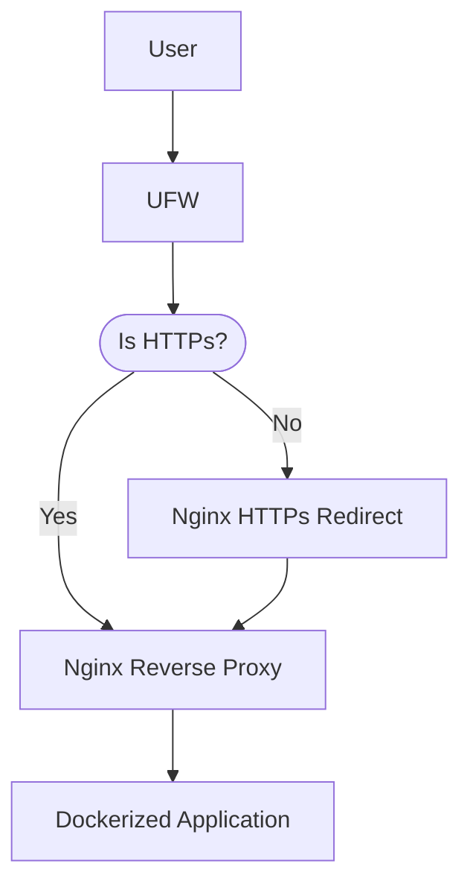

# Развертывание

> Данный раздел предназначен исключительно для разработчиков
{style="warning"}

В данном разделе предоставлена информация по конфигурации и развертыванию **TestSys**. 
TestSys состоит из двух единиц развертывания --- клиента и сервера проверки, каждый из которых разворачивается при 
помощи docker-compose файла. Обе единицы могут быть развернуты как на одном сервере, так и на разных. 
Далее будут подробно рассмотрена конфигурация систем и предложен вариант полного развертывания.

## Конфигурация клиента

Для развертывания клиента используется следующий docker-compose файл:

```docker
version: '3'

services:
  mysql_host:
    image: mysql:9.1.0
    restart: always

    environment:
      MYSQL_USER: testsys
      MYSQL_ALLOW_EMPTY_PASSWORD: 'yes'
      MYSQL_DATABASE: testsys_db
      MYSQL_PASSWORD: p@ssw0rd

    ports:
      - "3306:3306"

    healthcheck:
      test: ["CMD", "mysqladmin" ,"ping", "-h", "localhost"]
      timeout: 20s
      retries: 10

    volumes:
      - ./data/mysql:/var/lib/mysql

  web-client:
    image: testsystrik/trik-testsys-web-client:<tag>
    restart: always

    environment:
      - JAVA_OPTIONS=-server -Xmx16g -Xms2g -XX:+HeapDumpOnOutOfMemoryError -XX:HeapDumpPath=/web-client/dumps/ -XX:+CrashOnOutOfMemoryError -XX:+UseG1GC -XX:MaxGCPauseMillis=200 -XX:ParallelGCThreads=6 -XX:ConcGCThreads=3
      - TRIK_STUDIO_VERSION=testsystrik/trik-studio:<tag-trik-studio>

    ports:
      - "8888:8888"
    expose:
      - "8888"

    volumes:
      - ./logs/web-client:/web-client/logs
      - ./data:/web-client/data
      - ./dumps:/web-client/dumps
    links:
      - mysql_host:mysql_host

    depends_on:
      mysql_host:
        condition: service_healthy
```

Перед использованием данного файла рекомендуется сравнить его с
[актуальной версией](https://github.com/Pupsen-Vupsen/trik-testsys-web-client/blob/master/docker-compose.yml)
и, в случае обнаружения расхождений, обратиться к разработчикам для уточнений по изменениям.

Рекомендуется использовать сервер с количеством нативных потоков не менее 4. 
Также сервер должен обладать оперативной памятью в объеме не менее 6 Гб.

> Предоставленные параметры сервера подходят для использования небольшой группой учеников не более 20 человек,
> в случае необходимости масштабирования рекомендуется обратиться к разработчикам.
{style="note"}

Вместо `<tag-trik-studio>` необходимо использовать последний
[релиз](https://hub.docker.com/r/testsystrik/trik-studio/tags)
`testsystrik/trik-studio`.

Вместо `<tag>` необходимо использовать последний
[релиз](https://hub.docker.com/r/testsystrik/trik-testsys-web-client/tags)
`testsystrik/trik-testsys-web-client`.

> Рекомендуется избегать использования тега latest поскольку это затрудняет
> отслеживание того, какая версия образа запущена,
> и затрудняет откат до нужной версии.
{style="note"}

Последним требование является наличие директорий `web-client/logs`, `web-client/data`, `web-client/dumps` 
в том же расположении, что и docker-compose файл.

## Конфигурация сервера проверки

Для развертывания сервера проверки используется следующий docker-compose файл:

```docker
services:

  grading-node:
    image: testsystrik/grading-node:<tag>
    restart: always
    environment:
      - MOUNTED_DIRECTORY=/grading-node-workspace
      - HOST_DIRECTORY=${PWD}/grading-node-workspace
      - INNER_TIMEOUT_SECONDS=300
      - ASPNETCORE_HTTP_PORTS=
      - NODE_ID=0
      - WORKERS_COUNT=<uint>
    volumes:
      - ./grading-node-workspace:/grading-node-workspace
      - /var/run/docker.sock:/var/run/docker.sock
    ports:
      - 8080:8080
```

Перед использованием данного файла рекомендуется сравнить его с 
[актуальной версией](https://github.com/Pupsen-Vupsen/trik-testsys-grading-node/blob/main/docker-compose.yml) 
и, в случае обнаружения расхождений, обратиться к разработчикам для уточнений по изменениям. 

Ключевым параметром в данном файле является `WORKERS_COUNT`, который отвечает 
за количество одновременно проверяемых решений.
Данный параметр следует установить равным `THREADS_COUNT - 2`, где `THREADS_COUNT` количество нативных потоков 
предназначенных для данного приложения. Также сервер должен обладать оперативной памятью в объеме не менее 
`1 Гб * WORKERS_COUNT`.

Вместо `<tag>` необходимо использовать последний 
[релиз](https://hub.docker.com/r/testsystrik/grading-node/tags) 
`testsystrik/grading-node`. 

> Рекомендуется избегать использования тега latest поскольку это затрудняет 
> отслеживание того, какая версия образа запущена, 
> и затрудняет откат до нужной версии.
{style="note"}

Последним требование является наличие директории `grading-node-workspace` в том же расположении, 
что и docker-compose файл.

## Возможный вариант развертывания

В данном разделе описан вариант полного развертывания 
включая конфигурацию вспомогательного окружения.
Подразумевается использование операционной системы Ubuntu 18 или Ubuntu 20.
Схематичное описание системы представлено на следующей диаграмме.



### Необходимые пакеты
 
Перед установкой необходимых пакетов рекомендуется обновить локальный индекс пакетов следующей командой:

```bash
sudo apt update
```

Все необходимые пакеты, кроме docker, устанавливаются из apt репозитория:

```bash
sudo apt install nginx ufw
```

Установка docker подробно описана в следующем [руководстве](https://docs.docker.com/engine/install/ubuntu/).


### Совместимость ufw и docker

> Пропуск данного этапа конфигурации ведет к уязвимостям в безопасности
{style="warning"}

По умолчанию когда Docker обходит правила ufw и к опубликованным портам можно получить доступ извне.
Подробное описание проблемы и ее решения приведены в скудеющем [репозитории](https://github.com/chaifeng/ufw-docker).
В данном разделе приведен один из вариантов устранения проблемы.

Измените файл конфигурации ufw `/etc/ufw/after.rules` и добавьте следующие правила в конец файла:
```
# BEGIN UFW AND DOCKER
*filter
:ufw-user-forward - [0:0]
:ufw-docker-logging-deny - [0:0]
:DOCKER-USER - [0:0]
-A DOCKER-USER -j ufw-user-forward

-A DOCKER-USER -j RETURN -s 10.0.0.0/8
-A DOCKER-USER -j RETURN -s 172.16.0.0/12
-A DOCKER-USER -j RETURN -s 192.168.0.0/16

-A DOCKER-USER -p udp -m udp --sport 53 --dport 1024:65535 -j RETURN

-A DOCKER-USER -j ufw-docker-logging-deny -p tcp -m tcp --tcp-flags FIN,SYN,RST,ACK SYN -d 192.168.0.0/16
-A DOCKER-USER -j ufw-docker-logging-deny -p tcp -m tcp --tcp-flags FIN,SYN,RST,ACK SYN -d 10.0.0.0/8
-A DOCKER-USER -j ufw-docker-logging-deny -p tcp -m tcp --tcp-flags FIN,SYN,RST,ACK SYN -d 172.16.0.0/12
-A DOCKER-USER -j ufw-docker-logging-deny -p udp -m udp --dport 0:32767 -d 192.168.0.0/16
-A DOCKER-USER -j ufw-docker-logging-deny -p udp -m udp --dport 0:32767 -d 10.0.0.0/8
-A DOCKER-USER -j ufw-docker-logging-deny -p udp -m udp --dport 0:32767 -d 172.16.0.0/12

-A DOCKER-USER -j RETURN

-A ufw-docker-logging-deny -m limit --limit 3/min --limit-burst 10 -j LOG --log-prefix "[UFW DOCKER BLOCK] "
-A ufw-docker-logging-deny -j DROP

COMMIT
# END UFW AND DOCKER
```

После изменения файла перезапустите ufw используя:

```bash
sudo ufw reload
```

Также рекомендуется перезапустить сервер.

### Конфигурация ufw

> Пропуск данного этапа конфигурации ведет к уязвимостям в безопасности
{style="warning"}

Следующим этапом после установки пакетов является конфигурация ufw.
В первую очередь необходимо установить политики по умолчанию, 
рекомендуется отклонять все входящие соединения и разрешать все исходящие. 

```bash
sudo ufw default deny incoming
```

```bash
sudo ufw default allow outgoing
```

Далее необходимо разрешить ssh подключения используя следующую команду:

```bash
sudo ufw allow ssh
```

Также необходимо разрешить http и https подключения:

```bash
sudo ufw allow 'Nginx Full'
```

Далее, рекомендуется проверить какие правила были добавлены на данный момент при помощи команды:

```bash
sudo ufw show added
```

> Уделите особенное внимание разрешению на ssh подключения, в противном случае вы можете потерять соединение с сервером 
{style="warning"}

После проверки необходимо включить ufw:

```bash
sudo ufw enable
```

### Конфигурация nginx https redirection

> Пропуск данного этапа конфигурации ведет к уязвимостям в безопасности
{style="warning"}

Поскольку протокол общения с клиентом подразумевает передачу чувствительных данных крайне не рекомендуется 
использовать http. Одним из вариантов является запрет на использования http в параметрах ufw, 
однако это может негативно сказаться на пользовательском опыте, поэтому рекомендуется переадресовывать http соединения 
на https.

Для этого предлагается использовать следующую конфигурацию:

```nginx
server {
    listen 80 default_server;

    server_name _;

    return 301 https://$host$request_uri;
}
```

Данную конфигурацию необходимо поместить в файл `/etc/nginx/sites-available/https-redirection`
и включить с помощью команды:

```bash
sudo ln -s /etc/nginx/sites-available/https-redirection /etc/nginx/sites-enabled/
```

Далее проверьте, нет ли синтаксических ошибок:

```bash
sudo nginx -t
```

И перезапустите nginx:

```bash
sudo systemctl restart nginx
```

### Конфигурация nginx reverse proxy

Для маршрутизирования запросов к серверу используется nginx reverse proxy. 

Рекомендуется использовать следующий шаблон:

```nginx
server {
    listen 443 ssl default_server;
    listen [::]:443 ssl default_server;

    server_name <domain>;

    access_log /var/log/nginx/proxy-access.log;
    error_log /var/log/nginx/proxy-error.log;

    ssl_certificate /etc/letsencrypt/live/<domain>/fullchain.pem;
    ssl_certificate_key /etc/letsencrypt/live/<domain>/privkey.pem;

    location / {
        proxy_set_header Host $host;
        proxy_set_header X-Real-IP $remote_addr;
        proxy_set_header X-Forwarded-For $proxy_add_x_forwarded_for;
        proxy_set_header X-Forwarded-Proto $scheme;
        proxy_set_header X-Forwarded-Host $host;
        proxy_set_header X-Forwarded-Port $server_port;
        proxy_pass http://localhost:<port>/;
    }
}
```

Для использования данного шаблона вам необходимо получить https сертификат любым удобным способом 
(например при помощи [Certbot](https://certbot.eff.org/)).  
После получения сертификата необходимо заменить `<domain>` на ваше доменное имя, а `<port>` на порт клиента 
(в случае если вы не редактировали docker-compose файл клиента это 8888).

После этого необходимо поместить заполненный шаблон в файл `/etc/nginx/sites-available/reverse-proxy`
и включить конфигурацию с помощью команды:

```bash
sudo ln -s /etc/nginx/sites-available/reverse-proxy /etc/nginx/sites-enabled/
```

Далее проверьте, нет ли синтаксических ошибок:

```bash
sudo nginx -t
```

И перезапустите nginx:

```bash
sudo systemctl restart nginx
```

### Запуск приложений

Приложения должны запускаться в следующем порядке:
1. Сервер проверки
2. Клиент

Для запуска приложения достаточно использовать следующую команду в соответствующей директории:

```bash
docker compose up -d
```
